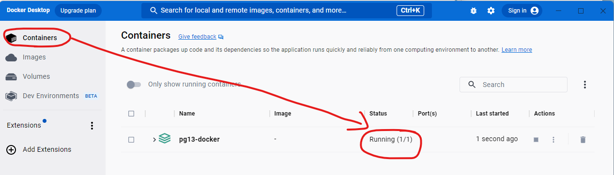
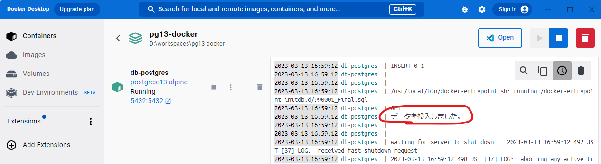

# 開発環境作成手順

## はじめに

このドキュメントはシステム開発者向けのドキュメントです。

## 事前準備

開発環境については[こちら](/environment/README.md)を参照

## データベース作成

適当なフォルダ(D:\workspace 等)を作成し、git から本プロジェクトをチェックアウトする

```cmd
cd /d [作成したフォルダ]
git clone https://github.com/yamayasunet/pg13-docker.git
```

.env ファイルを自分の環境に合わせて修正する。（なにもいじらなくても動作します）

| 設定キー          | defalut     | 内容          |
| ----------------- | ----------- | ------------- |
| POSTGRES_USER     | pg-user     | DB ユーザ名   |
| POSTGRES_PASSWORD | pg-password | DB パスワード |
| POSTGRES_DB       | pg-db       | DB 名         |

Docker を起動する
コマンドプロンプトを開き、以下のコマンドを実行する。

```cmd
cd pg13-docker
docker-compose up -d
```

正常終了したかどうかを確認する。  
Docker Desktop を起動し、Containers → pg13-docker の Status あたりをクリックする。  


コンソール画面に、以下のメッセージが表示されていることを確認する。  


## 再構築

※再構築のため、登録されていたデータはすべて削除されます。

```cmd
cd /d [作成したフォルダ]/pg13-docker
docker-compose down -v
docker-compose up -d
```

## 各種設定

設定値は以下の通り

| 項目          | 設定値      |
| :------------ | :---------- |
| サービス名    | pg-postgres |
| コンテナ名    | pg-postgres |
| ポート        | 5432        |
| DB ユーザ     | pg-user     |
| DB パスワード | pg-password |
| DB 名         | pg-db       |
