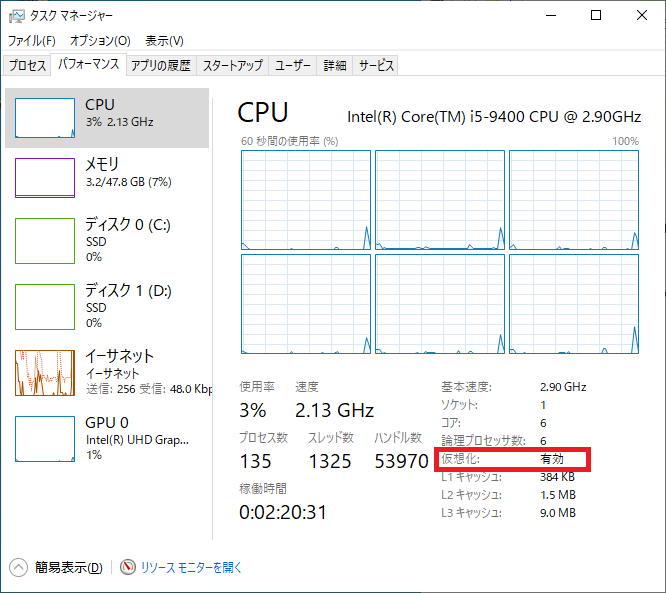
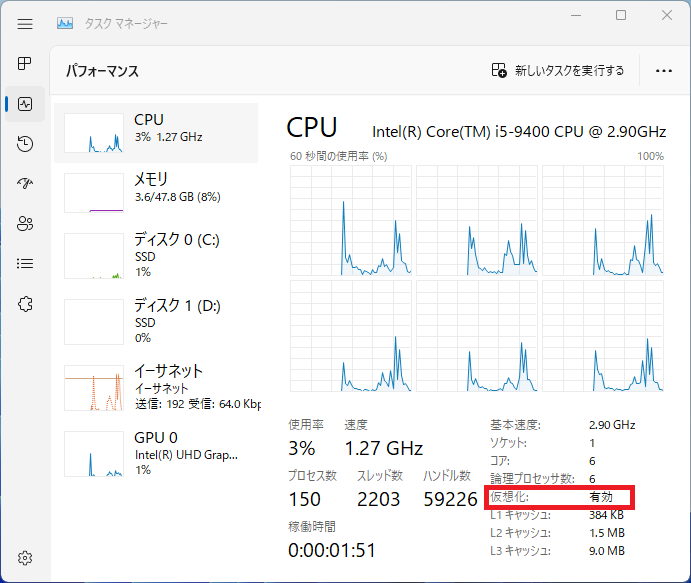
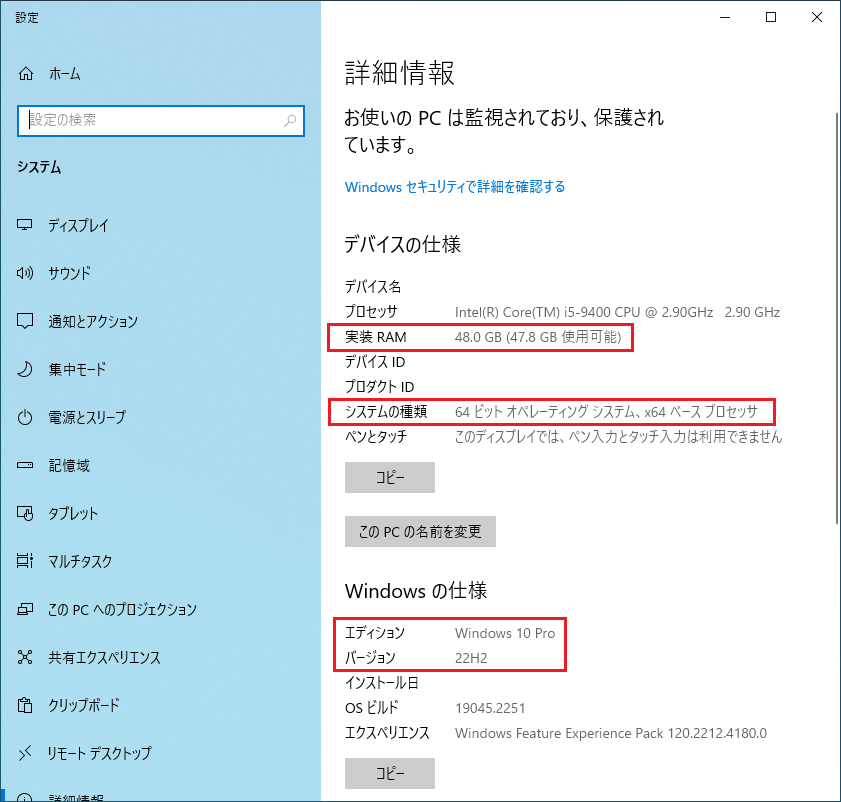
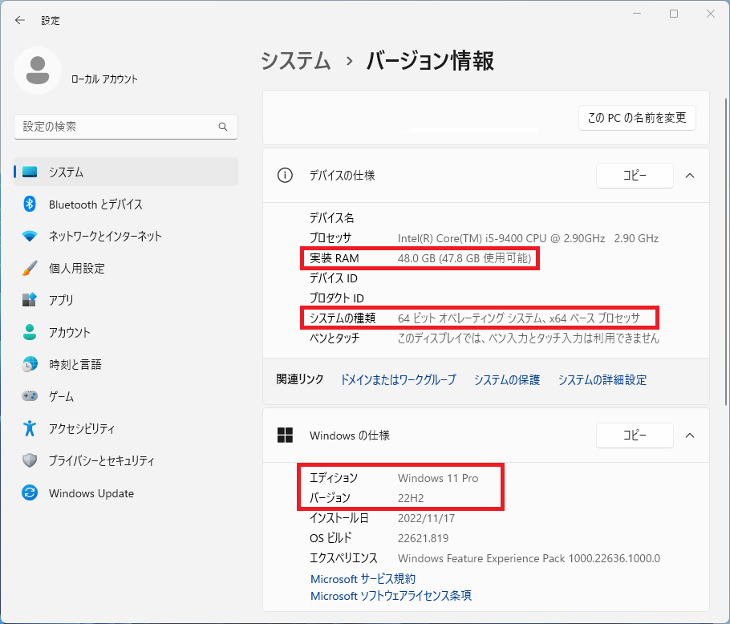

# 開発環境

## はじめに

このドキュメントは開発するにあたって必要なソフトウェアのインストール方法を記載しています。

## ハードウェア環境

開発において必要なハードウェアは以下のスペックを満たすこと。

| 項目     |                                                  | 確認方法                     |
| -------- | ------------------------------------------------ | ---------------------------- |
| CPU      | 仮想化機能に対応した CPU(Intel VT-x/AMD AMD-V)   | [確認方法](#cpu-の確認方法)  |
| メモリ   | 16GB 以上                                        | [確認方法](#メモリos-の確認) |
| OS       | Microsoft Windows 10/11 64bit (22H2 以降)        | [確認方法](#メモリos-の確認) |
| ディスク | 空き容量 10GB 以上(できれば 50GB 以上) ※SSD 推奨 | エクスプローラで確認         |

## 確認方法

### CPU の確認方法

［Ctrl］＋［Shift］＋［Esc］キーを押下し、タスクマネージャーを起動する。  
（スタートボタンを右クリックし、タスクマネージャーを選択でも可）
パフォーマンスタブの CPU を選択し、仮想化が有効であることを確認する。

【Windows 10】  

【Windows 11】  

### メモリ/OS の確認

[Windows] ＋ [Pause]キーを押し、システムの詳細情報を開く  
（スタートボタンを右クリックし、システムを選択でも可）

情報が表示されるため実装 RAM/システムの種類/エディション/バージョンを確認する。

【Windows 10】  

【Windows 11】  

## 環境構築手順

### Windows 環境の準備

インストールをスムーズに行うため、事前に確認しておくものがあります。
OS のバージョンによって手順が異なるため、使用している OS によって準備をすすめてください。

[Windows 10 の場合](./Windows10.md)

[Windows 11 の場合](./Windows11.md)

### ソフトウェアのインストール

ソフトウェアについては以下のページ参照。

[ソフトウェアのインストール](./software.md)
