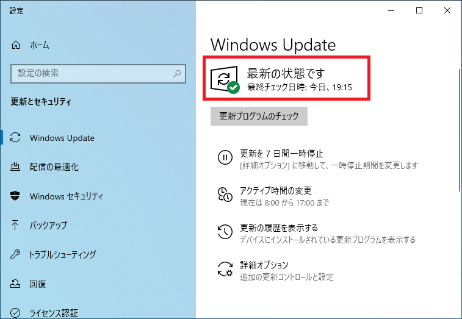
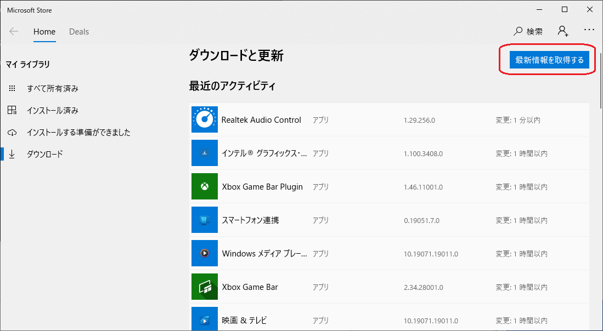
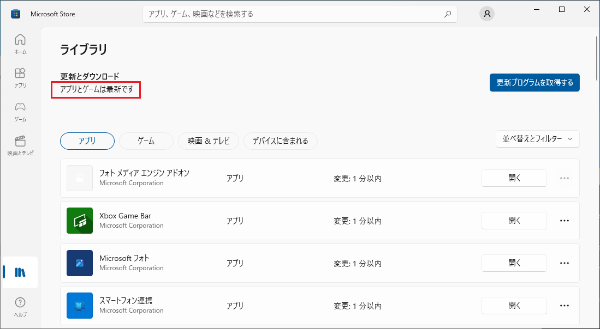
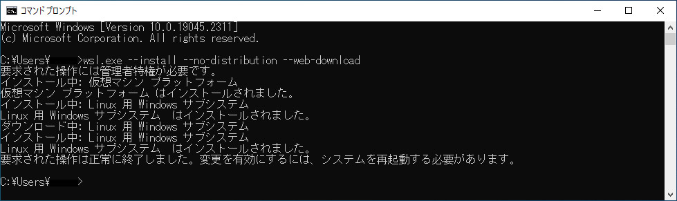

# Windows 環境の準備(Windows 10 編)

手順は以下の通り

1. [Windows Update](#windows-update)
2. [Microsoft Store の更新](#microsoft-store-の更新)
3. [Windows Subsystem for Linux のインストール](#windows-subsystem-for-linux-のインストール)

## Windows Update

事前に Windows Update を実施し、最新にしておく。  
更新プログラムのチェックボタンを押下し、「最新の状態です」が表示されることを確認する。



## Microsoft Store の更新

Microsoft Store の更新を実施し、最新にしておく。

コマンドプロンプトを開き、以下のコマンドを実行する。

```cmd
start ms-windows-store://downloadsandupdates
```

Microsoft Sore の更新ページが表示されるため、最新情報を取得するボタンを押下し、最新になるまで待つ。



最新情報を取得するボタンを押下し、「アプリとゲームは最新です」が表示されることを確認する。



## Windows Subsystem for Linux のインストール

Windows Subsystem for Linux をインストールする。

コマンドプロンプトを開き、以下のコマンド実行する。

```cmd
wsl.exe --install --no-distribution --web-download
```



※ユーザアカウント制御のダイアログが表示された場合「はい」をクリックする。

変更を有効にするには、システムを再起動する必要があります。　と表示されたら、ＰＣを再起動する。
