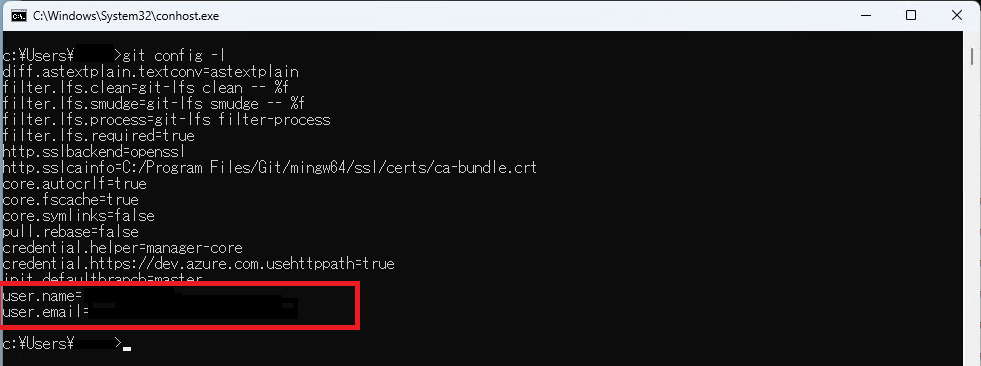
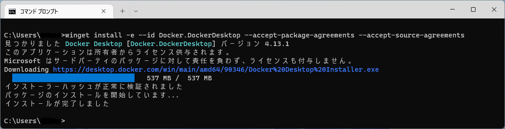
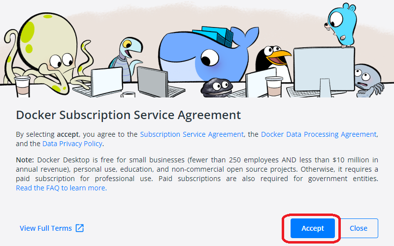
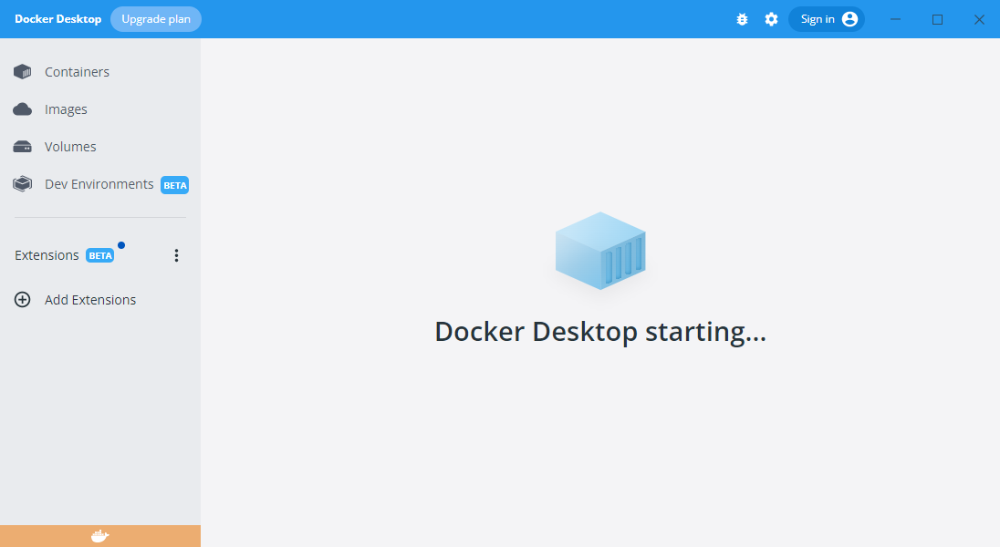
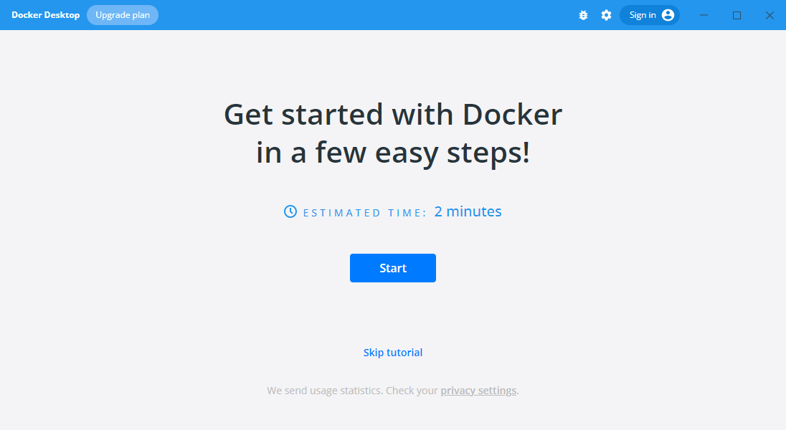
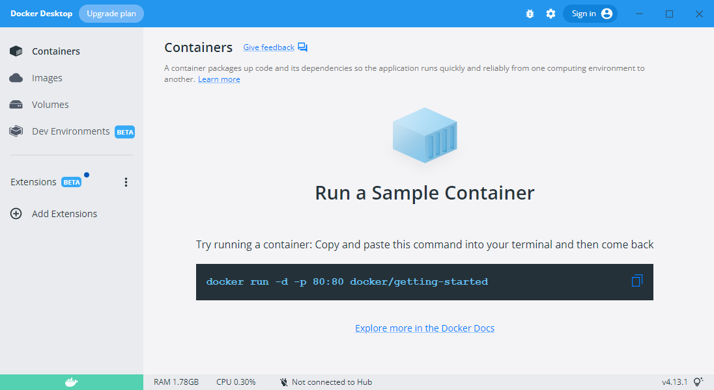

# ソフトウェアのインストール

各ソフトウェアについては以下の通り

【必須】

| ソフト名        | 説明               | インストール方法                                   |
| --------------- | ------------------ | -------------------------------------------------- |
| Git For Windows | ソース管理用       | [インストール方法](#docker-desktop-のインストール) |
| Docker Desktop  | 現在は Database 用 | [インストール方法](#docker-desktop-のインストール) |

【任意】

| ソフト名 | 説明               | インストール方法                            |
| -------- | ------------------ | ------------------------------------------- |
| DBeaver  | データベース操作用 | [インストール方法](#dbeaver-のインストール) |

## Git For Windows のインストール

コマンドプロンプトで以下のコマンドを実行する

```cmd
winget install -e --id Git.Git
```

※ユーザアカウント制御のダイアログが表示された場合「はい」をクリックする。

インストール後、いったんコマンドプロンプトを終了し、再度コマンドプロンプトを起動する。  
以下のコマンドを実行し、初期設定を行う。

名前やメールアドレスは各自のものに変更してください。

```cmd
git config --global user.name "ななしのごんべい"
git config --global user.email "gonbei-nanashi@xxx.xx.jp"
```

設定が正しくできているかを以下のコマンドで確認する。

```cmd
git config -l
```

設定した値が反映されているかどうかを確認する。  


## Docker Desktop のインストール

Docker のインストール手順は以下の通り

コマンドプロンプトで以下のコマンドを実行する

```cmd
winget install -e --id Docker.DockerDesktop --accept-package-agreements --accept-source-agreements
```

※インストール中に、ユーザアカウント制御のダイアログが表示された場合「はい」をクリックする。

  
インストールが完了しました　が表示されたら、ＰＣを再起動する。

再起動後、Docker Subscription Service Agreement のダイアログが表示されるため、Accept ボタンを押下し、Docker Desktop を起動する。



Docker の初期化処理が開始されるので、終了するまでしばらく待つ。(数分程度)



初回起動時には、チュートリアルの表示があるが、特に必要ないため下部に表示されている skip tutorial をクリックする。  


正常に終了した場合、以下の画面が表示され使用可能となる。


## DBeaver のインストール

DBeaver のインストール手順は以下の通り

コマンドプロンプトで以下のコマンドを実行する

```cmd
winget install -e --id dbeaver.dbeaver
```
